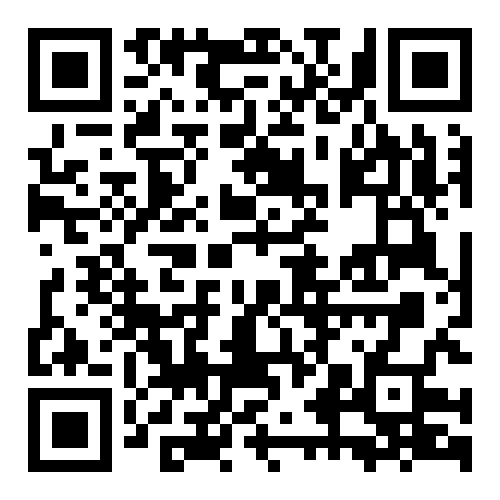

# 🚀 **Portfolio Website**

Welcome to my **Personal Portfolio Website**! This is a fully **responsive** and **interactive** website designed to showcase my skills, projects, and professional experience.

---

## 🎨 **Features**
✅ **Modern UI/UX** – A sleek, minimalistic design with a smooth user experience.  
✅ **Responsive Design** – Works on desktops, tablets, and mobile devices.  
✅ **Dark Mode** – Users can toggle between **Light Mode** and **Dark Mode**.  
✅ **PDF Resume Viewer** – My resume is embedded directly on the website for easy viewing.  
✅ **QR Code for Mobile Access** – Scan the QR code to open the site on your phone.  
✅ **Interactive Projects Section** – Clickable project cards with images, descriptions, and links.  
✅ **Contact Form** – Send me a message directly from the site.  

---

## 🛠 **Tech Stack**
This website is built using **modern web technologies**:
- 🌐 **HTML5**
- 🎨 **CSS3 (Flexbox, Grid, SCSS for styling)**
- ⚡ **JavaScript (DOM Manipulation, Theme Toggle, QR Code Generation)**
- 🎭 **FontAwesome, Google Fonts**
- 📜 **Markdown (`README.md` for documentation)**

---

## 📂 **Project Structure**
```
/portfolio
│── /assets
│   │── /css/     # Stylesheets
│   │── /img/     # Images and icons
│   │── /js/      # JavaScript files
│   │── /pdf/     # Resume and other PDFs
│   │── /scss/    # SCSS files for styling
│── index.html    # Main landing page
│── README.md     # Project documentation (this file)
```

---

## 📖 **How to Use**
### 🔹 **Run Locally**
1. **Clone the repository**:
   ```sh
   git clone https://github.com/your-username/portfolio.git
   cd portfolio
   ```
2. **Open `index.html`** in your browser or use **VS Code Live Server**.
3. **Customize content, styles, and projects** as needed.

---

## 📱 **QR Code for Easy Access**
Scan the QR code below to open this portfolio on your phone:  


---

## 📬 **Contact Me**
📧 **Email:** [adrian01magno@gmail.com](mailto:adrian01magno@gmail.com)  
💼 **LinkedIn:** [linkedin.com/in/amagno01](https://www.linkedin.com/in/amagno01)  
📂 **GitHub:** [github.com/your-username](https://github.com/amagno01)

---


### 🚀 **Inspired design by Bedimcode**
